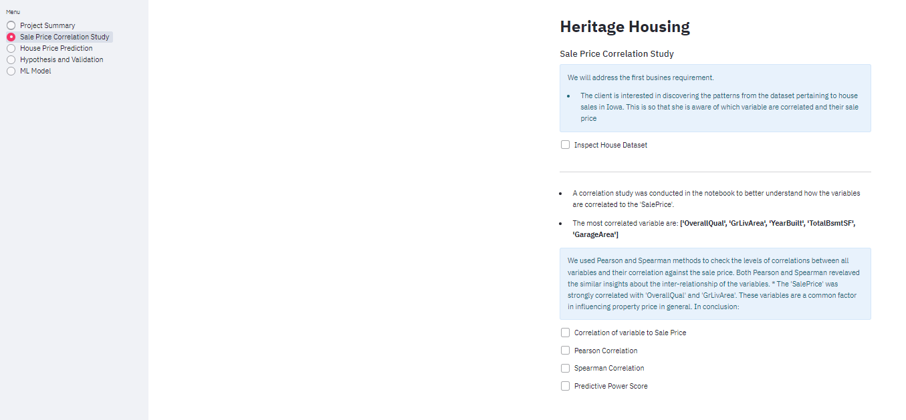
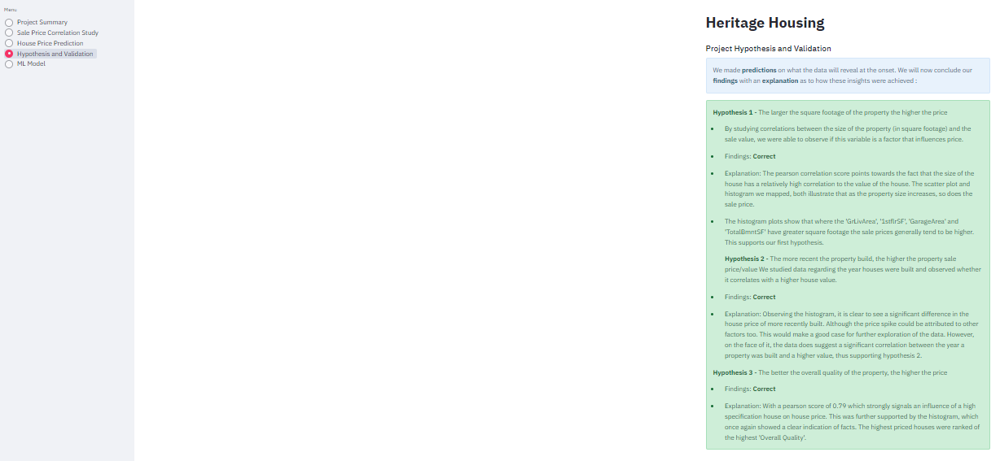
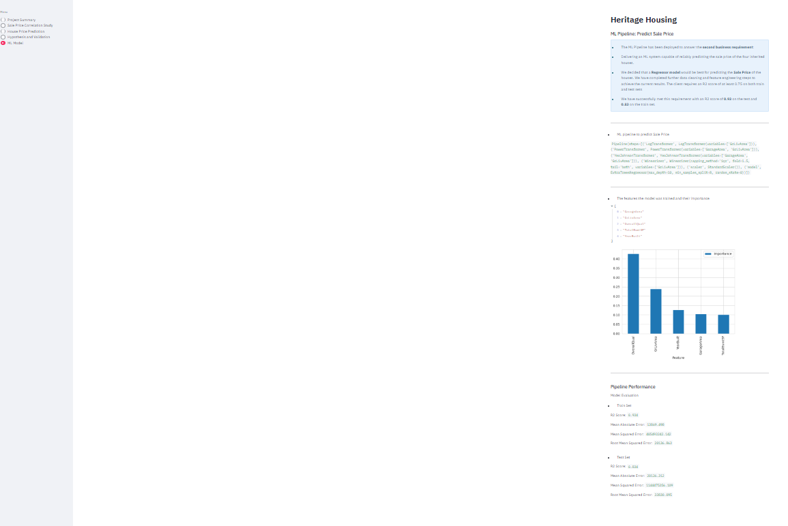

# Heritage Housing Issues

This is my 5th and final project for the Code Institute "Full Stack Dveloper" Diploma. 
Predictive Analytics is something which has always interested me and I have been very excited to reach this point in the course. I had longed to learn and practice these skills, as well as gain an understanding into a world which fascinates me. I present my [first ever dashboard,](https://heritagehouse.herokuapp.com/) but certainly not my last. 

---
# Table of Contents

Table of Contents

* [Dataset Content](#dataset-content)
* [Business Requirements](#business-requirements)
* [User Stories](#user-stories)
* [Hypothesis and how to validate?](#hypothesis-and-how-to-validate?)
* [Rationale to map the business requirements to the Data Visualizations and ML tasks](#rationale-to-map-the-business-requirements-to-the-data-visualizations-and-ml-tasks) 
* [ML Business Case](#ml-business-case)
* [Dashboard Design](#dashboard-design)
* [Bugs](#bugs)
* [Deployment](#deployment)  
* [Main Data Analysis and Machine Learning Libraries](#main-data-analysis-and-machine-learning-libraries) 
* [Credits](#credits)  

---
## Dataset Content
* The dataset is sourced from [Kaggle](https://www.kaggle.com/codeinstitute/housing-prices-data). 
We then created a fictitious user story where predictive analytics can be applied in a real project in the workplace. 

* The dataset has almost 1.5 thousand rows and represents housing records from Ames, Iowa; indicating house profile (Floor Area, Basement, Garage, Kitchen, Lot, Porch, Wood Deck, Year Built) and its respective sale price for houses built between 1872 and 2010.

|Variable|Meaning|Units|
|:----|:----|:----|
|1stFlrSF|First Floor square feet|334 - 4692|
|2ndFlrSF|Second-floor square feet|0 - 2065|
|BedroomAbvGr|Bedrooms above grade (does NOT include basement bedrooms)|0 - 8|
|BsmtExposure|Refers to walkout or garden level walls|Gd: Good Exposure; Av: Average Exposure; Mn: Minimum Exposure; No: No Exposure; None: No Basement|
|BsmtFinType1|Rating of basement finished area|GLQ: Good Living Quarters; ALQ: Average Living Quarters; BLQ: Below Average Living Quarters; Rec: Average Rec Room; LwQ: Low Quality; Unf: Unfinshed; None: No Basement|
|BsmtFinSF1|Type 1 finished square feet|0 - 5644|
|BsmtUnfSF|Unfinished square feet of basement area|0 - 2336|
|TotalBsmtSF|Total square feet of basement area|0 - 6110|
|GarageArea|Size of garage in square feet|0 - 1418|
|GarageFinish|Interior finish of the garage|Fin: Finished; RFn: Rough Finished; Unf: Unfinished; None: No Garage|
|GarageYrBlt|Year garage was built|1900 - 2010|
|GrLivArea|Above grade (ground) living area square feet|334 - 5642|
|KitchenQual|Kitchen quality|Ex: Excellent; Gd: Good; TA: Typical/Average; Fa: Fair; Po: Poor|
|LotArea| Lot size in square feet|1300 - 215245|
|LotFrontage| Linear feet of street connected to property|21 - 313|
|MasVnrArea|Masonry veneer area in square feet|0 - 1600|
|EnclosedPorch|Enclosed porch area in square feet|0 - 286|
|OpenPorchSF|Open porch area in square feet|0 - 547|
|OverallCond|Rates the overall condition of the house|10: Very Excellent; 9: Excellent; 8: Very Good; 7: Good; 6: Above Average; 5: Average; 4: Below Average; 3: Fair; 2: Poor; 1: Very Poor|
|OverallQual|Rates the overall material and finish of the house|10: Very Excellent; 9: Excellent; 8: Very Good; 7: Good; 6: Above Average; 5: Average; 4: Below Average; 3: Fair; 2: Poor; 1: Very Poor|
|WoodDeckSF|Wood deck area in square feet|0 - 736|
|YearBuilt|Original construction date|1872 - 2010|
|YearRemodAdd|Remodel date (same as construction date if no remodelling or additions)|1950 - 2010|
|SalePrice|Sale Price|34900 - 755000|

## Business Requirements
As a good friend, you are requested by your friend, who has received an inheritance from a deceased great-grandfather located in Ames, Iowa, to help in maximising the sales price for the inherited properties.

Although your friend has an excellent understanding of property prices in her own state and residential area, she fears that basing her estimates for property worth on her current knowledge might lead to inaccurate appraisals. What makes a house desirable and valuable where she comes from might not be the same in Ames, Iowa. She found a public dataset with house prices for Ames, Iowa, and will provide you with that.

1 - The client is interested in discovering how the house attributes correlate with the sale price. Therefore, the client expects data visualisations of the correlated variables against the sale price to show that.

2 - The client is interested in predicting the house sale price from her four inherited houses and any other house in Ames, Iowa.

## Hypothesis and how to validate?

- Hypothesis 1 - The larger the square footage of the property the higher the price 
        * By studying correlations between the size of the property (in square footage) and the sale value, we will be able to observe if this variable is a factor that influences price. 

        - A correlation study will help with validating this. We will use relevant data visualisation tools here. 

- Hypothesis 2 - The more recent the property build, the higher the property sale price/value (null hypothesis)
        * We will study data regarding the house build data and observe whether it correlates with a higher house value. 
       
        - A correlation study will help with validating this. We will use relevant data visualisation tools here.

- Hypothesis 3 - The better the overall quality of the property, the higher the price
        * We will check whether a property that has been rated as having a higher "overall quality" will also be higher in value 
       
        - A correlation study will help with validating this. We will use relevant data visualisation tools here.

## The rationale to map the business requirements to the Data Visualisations and ML tasks
* ### Business Requirement 1: Data Visualisation and Correlation Study 

* ### Business Requirement 2: Regression Pipeline 

## ML Business Case
* We want to build an ML Model that will predict the sale price of a house in Ames, Iowa. 

## Dashboard Design

### Page 1 
### Project Summary 

### Page 2
### Sale Price Correlation Study 

### 

### Page 3
### Estimate House Price

### Page 4
### Hypothesis

### Page 5
### ML Pipeline

## Epics
* Information gathering and data collection.

* Data visualization, cleaning, and preparation.

* Model training, optimization and validation.

* Dashboard planning, designing, and development.

* Dashboard deployment and release.

## Unfixed Bugs
* Inherited house dataset. 

* Deployment fail 

## Deployment
### Heroku

* The App live link is: https://heritagehouse.herokuapp.com/ 
* The project was deployed to Heroku using the following steps.

1. Log in to Heroku and create an App

2. At the Deploy tab, select GitHub as the deployment method.

3. Select your repository name and click Search. Once it is found, click Connect.

4. Select the branch you want to deploy, then click Deploy Branch.

5. The deployment process should happen smoothly in case all deployment files are fully functional. Click now the button Open App on the top of the page to access your App.

## Main Data Analysis and Machine Learning Libraries
* Here you should list the libraries you used in the project and provide example(s) of how you used these libraries.

## Technologies used 
* Github - 
* Gitpod - Used as a local workspace 
* Streamlit - To develop and display dashboard
* Heroku - 

## Languages used
* Python 

## Refrences
https://pythonguides.com/how-to-find-duplicates-in-python-dataframe/
Checking for duplicated data  

## Credits 

- Kaggle - dataset on which the study was based
- Code Institute - for the learning materials and template for the project
- 
* In this section, you need to reference where you got your content, media and extra help from. It is common practice to use code from other repositories and tutorials, however, it is important to be very specific about these sources to avoid plagiarism. 
* You can break the credits section up into Content and Media, depending on what you have included in your project. 

### Content 

- The text for the Home page was taken from Wikipedia Article A
- Instructions on how to implement form validation on the Sign-Up page was taken from [Specific YouTube Tutorial](https://www.youtube.com/)
- The icons in the footer were taken from [Font Awesome](https://fontawesome.com/)

## Acknowledgements (optional)
* I would like to thank Neil McEwen of Code Institute for his patience and assitance with my many queries on slack

# Bugs 
I had a reoccuring issue where I had made extensive notes in markdown format, analysing the plots following feature engineering. The text and subsequent code kept on disapearing. I had to create a new gitpod workspace several times during this project to overcome this issue. 
